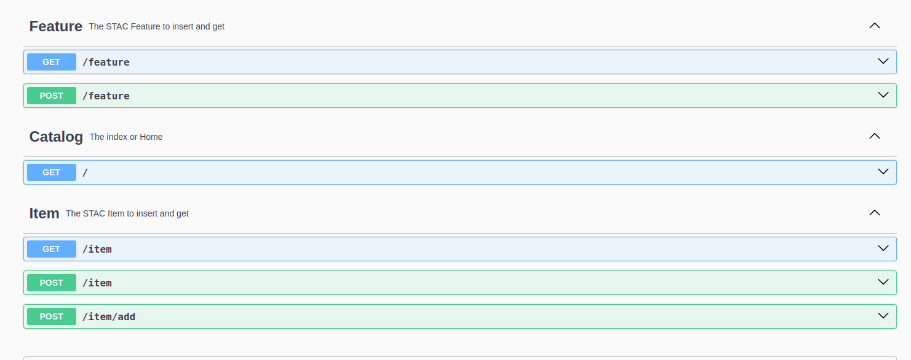
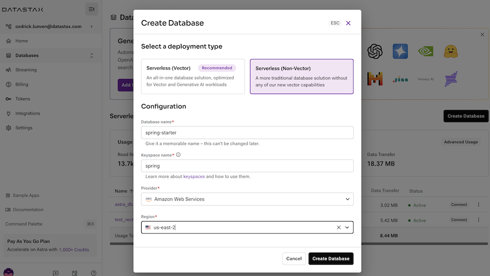
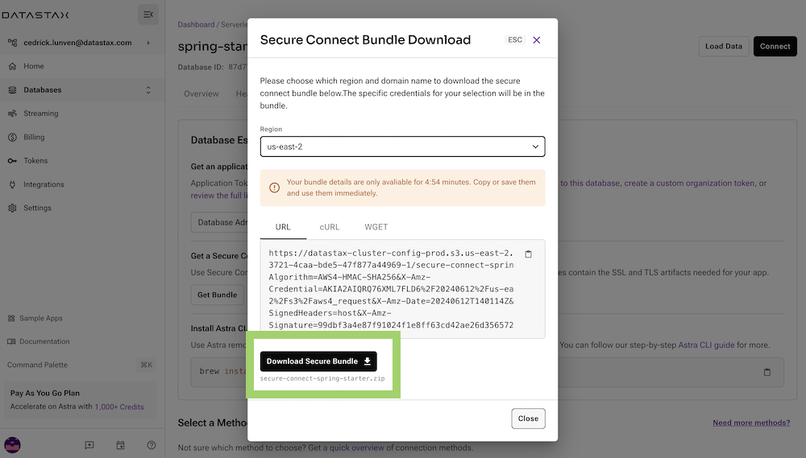
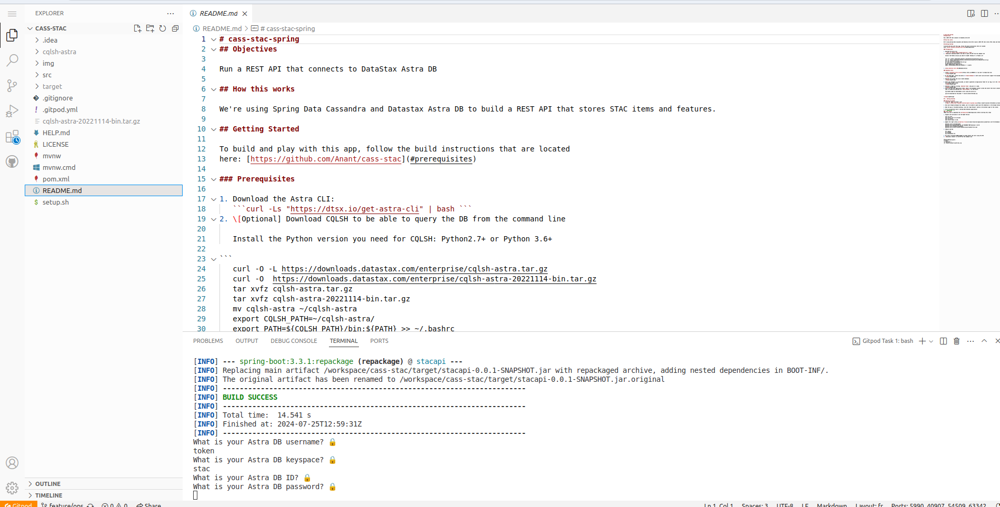
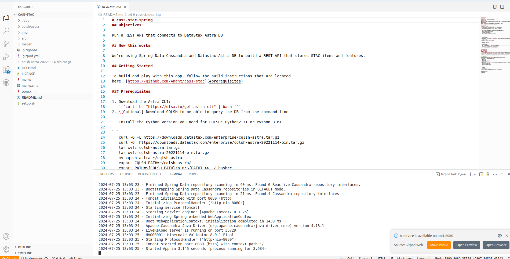
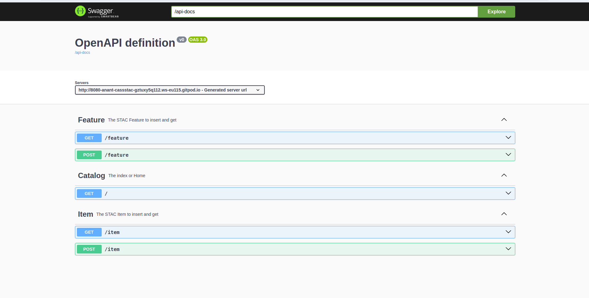

# STAC on Cassandra

The application uses Spring Data Cassandra and DataStax Astra DB to build a REST API for
a [Spatio-Temporal Asset Catalog (STAC)](https://stacspec.org/en) that can scale to hundreds of billions of STAC items.



## Objectives

Run a REST API that connects to DataStax Astra DB

## How this works

We're using Spring Data Cassandra and Datastax Astra DB to build a REST API that stores STAC items and features.

## Getting Started

To build and play with this app, follow the build instructions that are located
here: [https://github.com/Anant/cass-stac](#prerequisites)

### Prerequisites

1. Download the Astra CLI:
   ```curl -Ls "https://dtsx.io/get-astra-cli" | bash ```
2. \[Optional] Download CQLSH to be able to query the DB from the command line

   Install the Python version you need for CQLSH: Python2.7+ or Python 3.6+

   ```
   curl -O -L https://downloads.datastax.com/enterprise/cqlsh-astra.tar.gz
   curl -O  https://downloads.datastax.com/enterprise/cqlsh-astra-20221114-bin.tar.gz
   tar xvfz cqlsh-astra.tar.gz
   tar xvfz cqlsh-astra-20221114-bin.tar.gz
   mv cqlsh-astra ~/cqlsh-astra
   export CQLSH_PATH=~/cqlsh-astra/
   export PATH=${CQLSH_PATH}/bin:${PATH} >> ~/.bashrc
   ```

3. [Setup Datastax Astra DB](#DataStax-Astra)

### DataStax Astra

1. Create a [DataStax Astra account](https://dtsx.io/38HWu73) if you don't already have one:
   

2. On the home page. Locate the button **`Create Database`** both vector and non-vector support the Cassandra CQL
   

3. Populate the fields and click create database
   

4. After your database is provisioned, we need to generate an Application Token for our App. Go to the `Settings` tab in
   the database home screen.
   

5. Generate a token by clicking `Generate Token` and give it a name.
   
6. After you have your Application Token, head to the database connect screen and select the driver connection that we
   need. Go ahead and download the `Secure Bundle` for the driver.

   The bundle might be downloaded as well using the astra-cli:
   ```
   astra db download-scb <db_name> -f secure-connect-db-name.zip
   ```



## 🚀 Getting Started:

### Running on Gitpod

1. Click the 'Open in Gitpod' link:
   [](https://anant-cassstac-l27jvndv2xl.ws-eu115.gitpod.io/)

2. Once your Gitpod workspace has loaded, you'll be asked to paste your DB credentials in the Gitpod terminal at the
   bottom of the screen:
   

3. When the app is finished building, click the 'Open Browser' button on the bottom right of the screen:

   
4. You've successfully built a Spring Data Datastax application!
   

<!--- ENDEXCLUDE --->

### Local Setup

*Make sure you've completed the [prerequisites](#prerequisites) before starting this step*

1. Prepare Java and maven to be the Right Version
   ```
   sdk list java
   sdk install java 17.0.12-amzn
   sdk list maven
   sdk install maven 3.9.85. 
   ```
2. Update the right config [properties files](src/main/resources/application.properties) with the Database credentials
   ```
   datastax.astra.username=token
   datastax.astra.password=## FILL IN PASSWORD FROM Datastax's UI ##
   datastax.astra.keyspace=<keyspace>
   datastax.astra.secure-connect-bundle=<secure-bundle-file.zip>
   ```
3. Compile and Run
   ```
   mvn compile
   mvn package
   mvn spring-boot:run
   ```   
4. Hit http://localhost:8080/swagger-ui/index.html#/ and start using the API
5. \[Optional] Connect to the DB from the command line

```
$CQLSH_PATH/bin/cqlsh \
-u token \
-p <password> \
-b ./secure-connect-cass5-stac.zip
```
